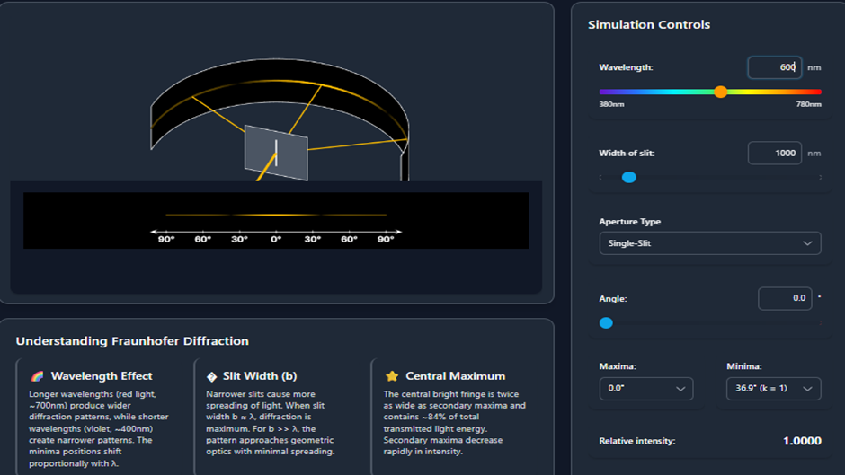

**Step 1:** Set the value of the wavelength (λ), angle (θ), and width of the slit (d) using the controls provided in the simulation.

**Step 2:** Click on either **Diffraction Pattern** or **Intensity Profile** to choose the display mode.

**Step 3:** When clicking on **Diffraction Pattern**, the pattern appearing on the screen is due to the single-slit aperture, as shown in Fig. 2.

   
  
<strong>Fig. 2</strong> — Diffraction Pattern due to Single-Slit Aperture

**Step 4:** If **Intensity Profile** is clicked, the pattern observed is as shown in Fig. 3. When k is set to 1, it will display two intensity profiles (one on each side of the central maximum).

   
  
<strong>Fig. 3</strong> — Intensity Profile due to Single-Slit Aperture

**Step 5:** Change the wavelength (λ) and the slit width (d) to observe different pattern formations. This provides an understanding of how the pattern varies with these parameters.

**Step 6:** Take 5–10 readings for different parameter values and record them in **Table 1** and **Table 2** below.

---

### Table 1: Slit Width vs. Order of Minima

**Fixed:** Wavelength λ = 600 nm 
**Formula:** d sinθ = kλ &nbsp;⟹&nbsp; θ = arcsin(kλ / d)

<table style="width:100%; border-collapse:collapse; text-align:center;">
  <thead>
    <tr style="background-color:#dce6f1;">
      <th style="border:1px solid #aaa; padding:6px;">S.No.</th>
      <th style="border:1px solid #aaa; padding:6px;">Slit Width <em>d</em> (nm)</th>
      <th style="border:1px solid #aaa; padding:6px;">Order <em>k</em></th>
      <th style="border:1px solid #aaa; padding:6px;">sin&thinsp;&theta;&nbsp;=&nbsp;k&lambda;/d</th>
      <th style="border:1px solid #aaa; padding:6px;">Angle of Minimum &theta; (degrees)</th>
      <th style="border:1px solid #aaa; padding:6px;">Calculated &lambda; = d&thinsp;sin&thinsp;&theta;/k (nm)</th>
    </tr>
  </thead>
  <tbody>
    <tr>
      <td style="border:1px solid #aaa; padding:6px;">1</td>
      <td style="border:1px solid #aaa; padding:6px;">1000</td>
      <td style="border:1px solid #aaa; padding:6px;">1</td>
      <td style="border:1px solid #aaa; padding:6px;">0.600000</td>
      <td style="border:1px solid #aaa; padding:6px;">36.870</td>
      <td style="border:1px solid #aaa; padding:6px;">600.0</td>
    </tr>
    <tr>
      <td style="border:1px solid #aaa; padding:6px;">2</td>
      <td style="border:1px solid #aaa; padding:6px;">1500</td>
      <td style="border:1px solid #aaa; padding:6px;">1</td>
      <td style="border:1px solid #aaa; padding:6px;">0.400000</td>
      <td style="border:1px solid #aaa; padding:6px;">23.578</td>
      <td style="border:1px solid #aaa; padding:6px;">600.0</td>
    </tr>
    <tr>
      <td style="border:1px solid #aaa; padding:6px;">3</td>
      <td style="border:1px solid #aaa; padding:6px;">1500</td>
      <td style="border:1px solid #aaa; padding:6px;">2</td>
      <td style="border:1px solid #aaa; padding:6px;">0.800000</td>
      <td style="border:1px solid #aaa; padding:6px;">53.130</td>
      <td style="border:1px solid #aaa; padding:6px;">600.0</td>
    </tr>
    <tr>
      <td style="border:1px solid #aaa; padding:6px;">4</td>
      <td style="border:1px solid #aaa; padding:6px;">2000</td>
      <td style="border:1px solid #aaa; padding:6px;">1</td>
      <td style="border:1px solid #aaa; padding:6px;">0.300000</td>
      <td style="border:1px solid #aaa; padding:6px;">17.458</td>
      <td style="border:1px solid #aaa; padding:6px;">600.0</td>
    </tr>
    <tr>
      <td style="border:1px solid #aaa; padding:6px;">5</td>
      <td style="border:1px solid #aaa; padding:6px;">2000</td>
      <td style="border:1px solid #aaa; padding:6px;">2</td>
      <td style="border:1px solid #aaa; padding:6px;">0.600000</td>
      <td style="border:1px solid #aaa; padding:6px;">36.870</td>
      <td style="border:1px solid #aaa; padding:6px;">600.0</td>
    </tr>
    <tr>
      <td style="border:1px solid #aaa; padding:6px;">6</td>
      <td style="border:1px solid #aaa; padding:6px;">3000</td>
      <td style="border:1px solid #aaa; padding:6px;">1</td>
      <td style="border:1px solid #aaa; padding:6px;">0.200000</td>
      <td style="border:1px solid #aaa; padding:6px;">11.537</td>
      <td style="border:1px solid #aaa; padding:6px;">600.0</td>
    </tr>
    <tr>
      <td style="border:1px solid #aaa; padding:6px;">7</td>
      <td style="border:1px solid #aaa; padding:6px;">3000</td>
      <td style="border:1px solid #aaa; padding:6px;">2</td>
      <td style="border:1px solid #aaa; padding:6px;">0.400000</td>
      <td style="border:1px solid #aaa; padding:6px;">23.578</td>
      <td style="border:1px solid #aaa; padding:6px;">600.0</td>
    </tr>
    <tr>
      <td style="border:1px solid #aaa; padding:6px;">8</td>
      <td style="border:1px solid #aaa; padding:6px;">4000</td>
      <td style="border:1px solid #aaa; padding:6px;">1</td>
      <td style="border:1px solid #aaa; padding:6px;">0.150000</td>
      <td style="border:1px solid #aaa; padding:6px;">8.627</td>
      <td style="border:1px solid #aaa; padding:6px;">600.0</td>
    </tr>
    <tr>
      <td style="border:1px solid #aaa; padding:6px;">9</td>
      <td style="border:1px solid #aaa; padding:6px;">4000</td>
      <td style="border:1px solid #aaa; padding:6px;">2</td>
      <td style="border:1px solid #aaa; padding:6px;">0.300000</td>
      <td style="border:1px solid #aaa; padding:6px;">17.458</td>
      <td style="border:1px solid #aaa; padding:6px;">600.0</td>
    </tr>
    <tr>
      <td style="border:1px solid #aaa; padding:6px;">10</td>
      <td style="border:1px solid #aaa; padding:6px;">5000</td>
      <td style="border:1px solid #aaa; padding:6px;">1</td>
      <td style="border:1px solid #aaa; padding:6px;">0.120000</td>
      <td style="border:1px solid #aaa; padding:6px;">6.892</td>
      <td style="border:1px solid #aaa; padding:6px;">600.0</td>
    </tr>
  </tbody>
</table>

---

### Table 2: Angle of Observation vs. Relative Intensity

**Fixed:** Slit width d = 1000 nm, Wavelength λ = 600 nm 
**Formula:** I/I₀ = (sinα / α)², where α = πd sinθ / λ

<table style="width:100%; border-collapse:collapse; text-align:center;">
  <thead>
    <tr style="background-color:#dce6f1;">
      <th style="border:1px solid #aaa; padding:6px;">S.No.</th>
      <th style="border:1px solid #aaa; padding:6px;">Angle &theta; (degrees)</th>
      <th style="border:1px solid #aaa; padding:6px;">&alpha; = &pi;d sin&theta;/&lambda; (rad)</th>
      <th style="border:1px solid #aaa; padding:6px;">Relative Intensity I/I&#8320;</th>
      <th style="border:1px solid #aaa; padding:6px;">Remarks</th>
    </tr>
  </thead>
  <tbody>
    <tr>
      <td style="border:1px solid #aaa; padding:6px;">1</td>
      <td style="border:1px solid #aaa; padding:6px;">0.00</td>
      <td style="border:1px solid #aaa; padding:6px;">0.000</td>
      <td style="border:1px solid #aaa; padding:6px;">1.000</td>
      <td style="border:1px solid #aaa; padding:6px;">Central maximum</td>
    </tr>
    <tr>
      <td style="border:1px solid #aaa; padding:6px;">2</td>
      <td style="border:1px solid #aaa; padding:6px;">5.00</td>
      <td style="border:1px solid #aaa; padding:6px;">0.456</td>
      <td style="border:1px solid #aaa; padding:6px;">0.934</td>
      <td style="border:1px solid #aaa; padding:6px;"></td>
    </tr>
    <tr>
      <td style="border:1px solid #aaa; padding:6px;">3</td>
      <td style="border:1px solid #aaa; padding:6px;">10.00</td>
      <td style="border:1px solid #aaa; padding:6px;">0.909</td>
      <td style="border:1px solid #aaa; padding:6px;">0.754</td>
      <td style="border:1px solid #aaa; padding:6px;"></td>
    </tr>
    <tr>
      <td style="border:1px solid #aaa; padding:6px;">4</td>
      <td style="border:1px solid #aaa; padding:6px;">15.00</td>
      <td style="border:1px solid #aaa; padding:6px;">1.356</td>
      <td style="border:1px solid #aaa; padding:6px;">0.520</td>
      <td style="border:1px solid #aaa; padding:6px;"></td>
    </tr>
    <tr>
      <td style="border:1px solid #aaa; padding:6px;">5</td>
      <td style="border:1px solid #aaa; padding:6px;">20.00</td>
      <td style="border:1px solid #aaa; padding:6px;">1.792</td>
      <td style="border:1px solid #aaa; padding:6px;">0.297</td>
      <td style="border:1px solid #aaa; padding:6px;"></td>
    </tr>
    <tr>
      <td style="border:1px solid #aaa; padding:6px;">6</td>
      <td style="border:1px solid #aaa; padding:6px;">25.00</td>
      <td style="border:1px solid #aaa; padding:6px;">2.213</td>
      <td style="border:1px solid #aaa; padding:6px;">0.131</td>
      <td style="border:1px solid #aaa; padding:6px;"></td>
    </tr>
    <tr>
      <td style="border:1px solid #aaa; padding:6px;">7</td>
      <td style="border:1px solid #aaa; padding:6px;">30.00</td>
      <td style="border:1px solid #aaa; padding:6px;">2.618</td>
      <td style="border:1px solid #aaa; padding:6px;">0.037</td>
      <td style="border:1px solid #aaa; padding:6px;"></td>
    </tr>
    <tr>
      <td style="border:1px solid #aaa; padding:6px;">8</td>
      <td style="border:1px solid #aaa; padding:6px;">35.00</td>
      <td style="border:1px solid #aaa; padding:6px;">3.002</td>
      <td style="border:1px solid #aaa; padding:6px;">0.002</td>
      <td style="border:1px solid #aaa; padding:6px;"></td>
    </tr>
    <tr>
      <td style="border:1px solid #aaa; padding:6px;">9</td>
      <td style="border:1px solid #aaa; padding:6px;">36.87</td>
      <td style="border:1px solid #aaa; padding:6px;">3.142</td>
      <td style="border:1px solid #aaa; padding:6px;">0.000</td>
      <td style="border:1px solid #aaa; padding:6px;">1st minimum (k = 1)</td>
    </tr>
    <tr>
      <td style="border:1px solid #aaa; padding:6px;">10</td>
      <td style="border:1px solid #aaa; padding:6px;">40.00</td>
      <td style="border:1px solid #aaa; padding:6px;">3.366</td>
      <td style="border:1px solid #aaa; padding:6px;">0.004</td>
      <td style="border:1px solid #aaa; padding:6px;"></td>
    </tr>
  </tbody>
</table>
