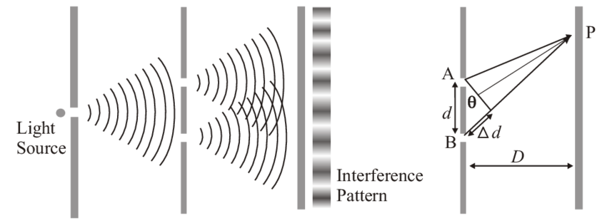

Light exhibits both wave-like and particle-like properties. One important consequence of its wave nature is **diffraction** — a phenomenon in which light bends slightly and spreads when it passes around the edges of an object or through a small aperture.

In **Fraunhofer diffraction**, both the source and the screen are at an infinite distance from the obstacle. As a result, the incident wavefront is plane. Fraunhofer diffraction is a specific type of diffraction that occurs when parallel light waves usually from a very distant source — pass through a narrow slit or diffracting object. The resulting pattern is observed on a screen at a far distance from the aperture, or at the focal plane of a converging lens. This far-field condition for a well-defined and stable diffraction pattern.

Let a parallel beam of monochromatic light of wavelength λ be incident normally upon a narrow slit **AB** of width d. After passing through the slit, the light gets diffracted and spreads out as shown in Fig. 1. If a converging lens **L** is placed in the path of the diffracted beam, a real image of the diffraction pattern is formed on the screen **SS′** at its focal plane.

   
  
<strong>Fig. 1</strong> — Fraunhofer Diffraction through a Single Slit

---

### Path Difference and Phase Difference

The **path difference** between rays from opposite edges of the slit is:

BD = AB sinθ = d sinθ &nbsp;&nbsp;&nbsp;&nbsp;&hellip;(1)

The corresponding **phase difference** is:

ϕ = (2π / λ) &middot; d sinθ &nbsp;&nbsp;&nbsp;&nbsp;&hellip;(2)

---

### Resultant Amplitude

Consider the width AB of the slit divided into n equal parts. Each part acts as an elementary source. The amplitude of vibration at point P₀ due to the wave from each part is the same (a), and the phase difference between waves from any two consecutive parts is:

&epsilon; = (1/n) &middot; (2π / λ) d sinθ

The **resultant amplitude** at P₀ is:

A = a &middot; sin(n&epsilon;/2) / sin(&epsilon;/2) &nbsp;&nbsp;&nbsp;&nbsp;&hellip;(3)

Letting α = πd sinθ / λ, the **intensity** at any point in the diffraction pattern is:

I = I₀ &middot; (sinα / α)² &nbsp;&nbsp;&nbsp;&nbsp;&hellip;(4)

where I₀ is the intensity at the central maximum (θ = 0).

---

### Condition for Maxima (Approximation)

θ = 0° &nbsp;&nbsp;(central maximum)

d sinθ &asymp; (k + &frac12;)λ &nbsp;&nbsp;for k = 0, 1, 2, 3, &hellip; &nbsp;&nbsp;&nbsp;&nbsp;&hellip;(5)

| Symbol | Description |
|--------|-------------|
| d | Width of slit |
| θ | Angle of diffraction |
| k | Order of maximum (k = 0, 1, 2, 3, …) |
| λ | Wavelength of light |

---

### Condition for Minima

d sinθ = kλ &nbsp;&nbsp;for k = 1, 2, 3, … &nbsp;&nbsp;&nbsp;&nbsp;&hellip;(6)

| Symbol | Description |
|--------|-------------|
| d | Width of slit |
| θ | Angle of diffraction (θ > 0°) |
| k | Order of minimum (k = 1, 2, 3, …) |
| λ | Wavelength of light |

The **half-angular width** of the central maximum is:

&Delta;θ = arcsin(λ / d) &asymp; λ / d &nbsp;&nbsp;(for small angles) &nbsp;&nbsp;&nbsp;&nbsp;&hellip;(7)

The intensity of the **first secondary maximum** is approximately 4.7% of the central maximum, occurring near α = 3π/2.